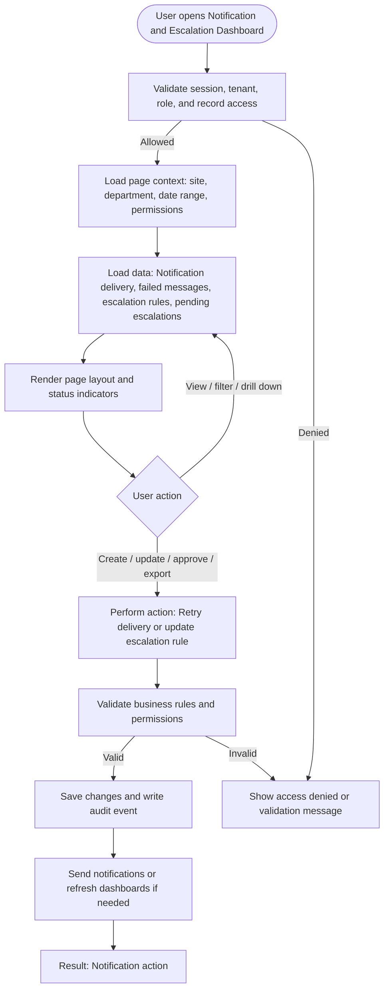

# Notification and Escalation Dashboard

| Field | Detail |
|---|---|
| Page Type | Dashboard |
| Module | Cross-cutting |
| Primary Roles | System Admin, Safety Manager |
| Purpose | Show alert delivery and escalation health. |

## What This Page Shows

| Area | Content |
|---|---|
| Header | Page title, site/tenant context, date range where applicable, role-aware actions |
| Filters | Status, site, department, owner, date range, severity, category, or module-specific filters |
| Main Content | Notification delivery, failed messages, escalation rules, pending escalations |
| Primary Action | Retry delivery or update escalation rule |
| Output | Notification action |
| Audit Behavior | View, create, update, approve, reject, export, and confidential access actions are audit logged where applicable |

## Page Flowchart

