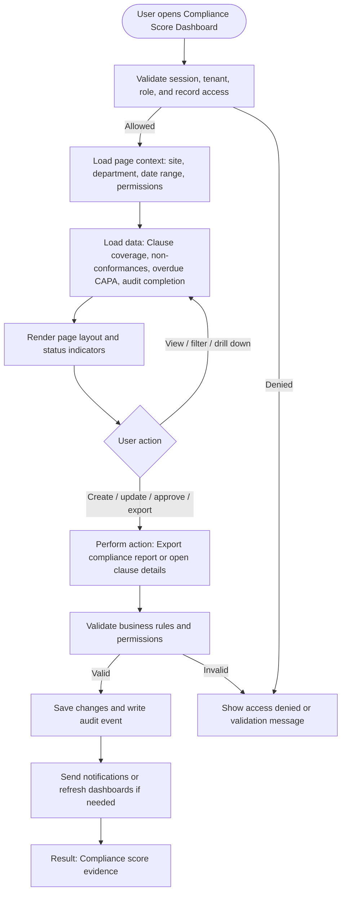

# Compliance Score Dashboard

| Field | Detail |
|---|---|
| Page Type | Dashboard |
| Module | Compliance |
| Primary Roles | Compliance Manager, Executive Sponsor |
| Purpose | Show ISO and internal compliance score. |

## What This Page Shows

| Area | Content |
|---|---|
| Header | Page title, site/tenant context, date range where applicable, role-aware actions |
| Filters | Status, site, department, owner, date range, severity, category, or module-specific filters |
| Main Content | Clause coverage, non-conformances, overdue CAPA, audit completion |
| Primary Action | Export compliance report or open clause details |
| Output | Compliance score evidence |
| Audit Behavior | View, create, update, approve, reject, export, and confidential access actions are audit logged where applicable |

## Page Flowchart

