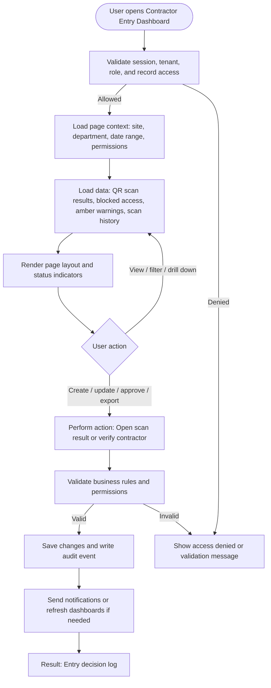

# Contractor Entry Dashboard

| Field | Detail |
|---|---|
| Page Type | Dashboard |
| Module | Vendor Compliance |
| Primary Roles | Gate Security Officer, Security Supervisor |
| Purpose | Show contractor entry decisions. |

## What This Page Shows

| Area | Content |
|---|---|
| Header | Page title, site/tenant context, date range where applicable, role-aware actions |
| Filters | Status, site, department, owner, date range, severity, category, or module-specific filters |
| Main Content | QR scan results, blocked access, amber warnings, scan history |
| Primary Action | Open scan result or verify contractor |
| Output | Entry decision log |
| Audit Behavior | View, create, update, approve, reject, export, and confidential access actions are audit logged where applicable |

## Page Flowchart

