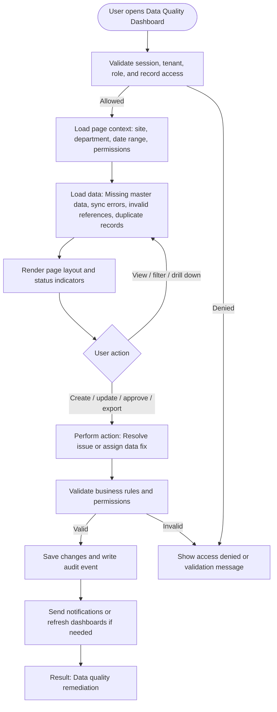

# Data Quality Dashboard

| Field | Detail |
|---|---|
| Page Type | Dashboard |
| Module | Administration |
| Primary Roles | Product Owner, System Admin |
| Purpose | Show missing or invalid data. |

## What This Page Shows

| Area | Content |
|---|---|
| Header | Page title, site/tenant context, date range where applicable, role-aware actions |
| Filters | Status, site, department, owner, date range, severity, category, or module-specific filters |
| Main Content | Missing master data, sync errors, invalid references, duplicate records |
| Primary Action | Resolve issue or assign data fix |
| Output | Data quality remediation |
| Audit Behavior | View, create, update, approve, reject, export, and confidential access actions are audit logged where applicable |

## Page Flowchart

