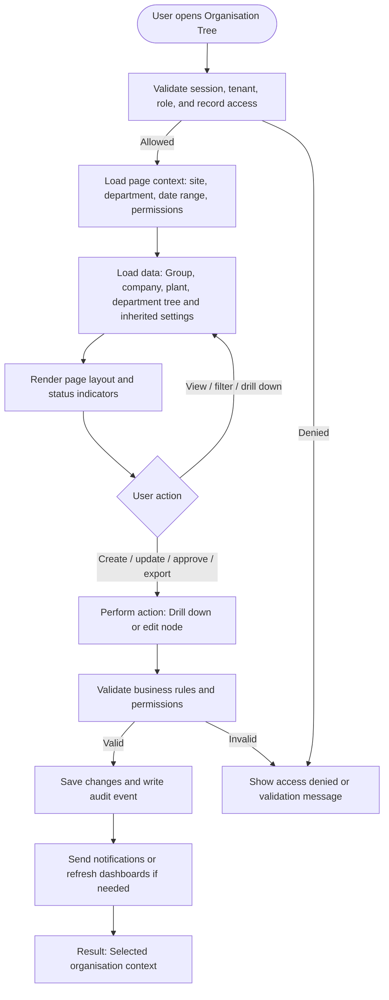

# Organisation Tree

| Field | Detail |
|---|---|
| Page Type | Web Page |
| Module | Foundation |
| Primary Roles | System Admin, Plant Manager |
| Purpose | View hierarchy. |

## What This Page Shows

| Area | Content |
|---|---|
| Header | Page title, site/tenant context, date range where applicable, role-aware actions |
| Filters | Status, site, department, owner, date range, severity, category, or module-specific filters |
| Main Content | Group, company, plant, department tree and inherited settings |
| Primary Action | Drill down or edit node |
| Output | Selected organisation context |
| Audit Behavior | View, create, update, approve, reject, export, and confidential access actions are audit logged where applicable |

## Page Flowchart

