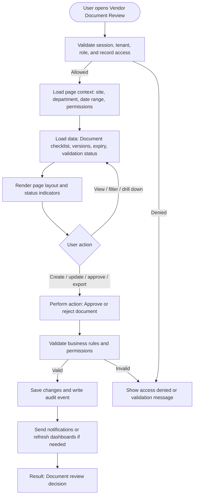

# Vendor Document Review

| Field | Detail |
|---|---|
| Page Type | Web Page |
| Module | Vendors |
| Primary Roles | Compliance Manager |
| Purpose | Review vendor documents. |

## What This Page Shows

| Area | Content |
|---|---|
| Header | Page title, site/tenant context, date range where applicable, role-aware actions |
| Filters | Status, site, department, owner, date range, severity, category, or module-specific filters |
| Main Content | Document checklist, versions, expiry, validation status |
| Primary Action | Approve or reject document |
| Output | Document review decision |
| Audit Behavior | View, create, update, approve, reject, export, and confidential access actions are audit logged where applicable |

## Page Flowchart

