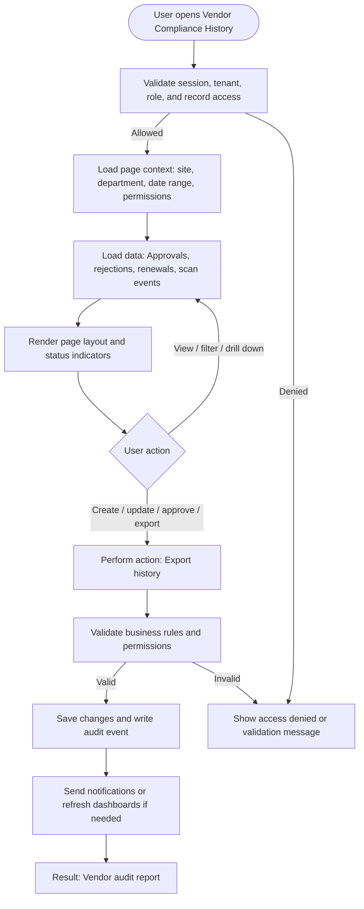

# Vendor Compliance History

| Field | Detail |
|---|---|
| Page Type | Web Page |
| Module | Vendors |
| Primary Roles | Auditor |
| Purpose | Review vendor audit history. |

## What This Page Shows

| Area | Content |
|---|---|
| Header | Page title, site/tenant context, date range where applicable, role-aware actions |
| Filters | Status, site, department, owner, date range, severity, category, or module-specific filters |
| Main Content | Approvals, rejections, renewals, scan events |
| Primary Action | Export history |
| Output | Vendor audit report |
| Audit Behavior | View, create, update, approve, reject, export, and confidential access actions are audit logged where applicable |

## Page Flowchart

