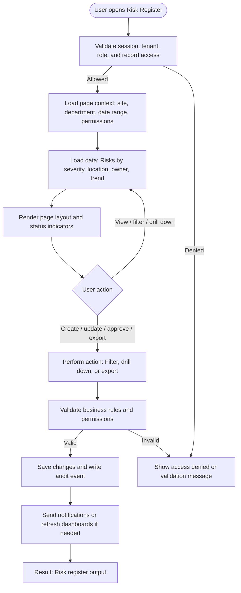

# Risk Register

| Field | Detail |
|---|---|
| Page Type | Web Page |
| Module | Risk |
| Primary Roles | Risk Manager |
| Purpose | Track risks. |

## What This Page Shows

| Area | Content |
|---|---|
| Header | Page title, site/tenant context, date range where applicable, role-aware actions |
| Filters | Status, site, department, owner, date range, severity, category, or module-specific filters |
| Main Content | Risks by severity, location, owner, trend |
| Primary Action | Filter, drill down, or export |
| Output | Risk register output |
| Audit Behavior | View, create, update, approve, reject, export, and confidential access actions are audit logged where applicable |

## Page Flowchart

