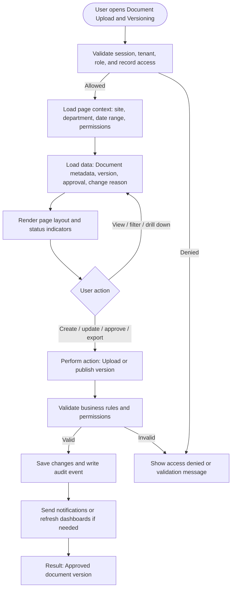

# Document Upload and Versioning

| Field | Detail |
|---|---|
| Page Type | Web Page |
| Module | Knowledge |
| Primary Roles | Document Controller |
| Purpose | Control documents. |

## What This Page Shows

| Area | Content |
|---|---|
| Header | Page title, site/tenant context, date range where applicable, role-aware actions |
| Filters | Status, site, department, owner, date range, severity, category, or module-specific filters |
| Main Content | Document metadata, version, approval, change reason |
| Primary Action | Upload or publish version |
| Output | Approved document version |
| Audit Behavior | View, create, update, approve, reject, export, and confidential access actions are audit logged where applicable |

## Page Flowchart

