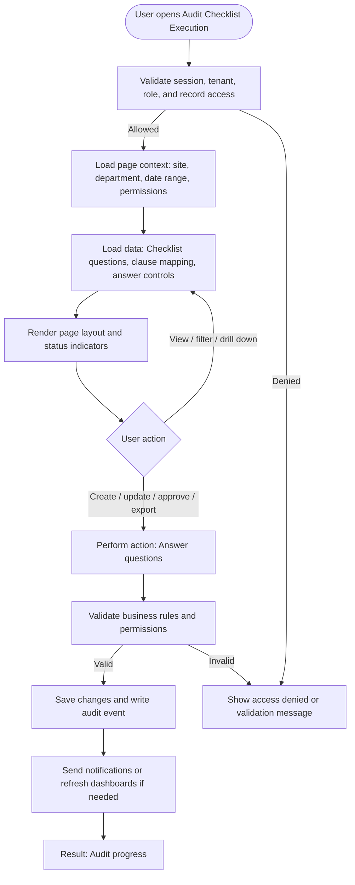

# Audit Checklist Execution

| Field | Detail |
|---|---|
| Page Type | Mobile Screen |
| Module | Mobile Audit |
| Primary Roles | Safety Auditor |
| Purpose | Execute checklist. |

## What This Page Shows

| Area | Content |
|---|---|
| Header | Page title, site/tenant context, date range where applicable, role-aware actions |
| Filters | Status, site, department, owner, date range, severity, category, or module-specific filters |
| Main Content | Checklist questions, clause mapping, answer controls |
| Primary Action | Answer questions |
| Output | Audit progress |
| Audit Behavior | View, create, update, approve, reject, export, and confidential access actions are audit logged where applicable |

## Page Flowchart

