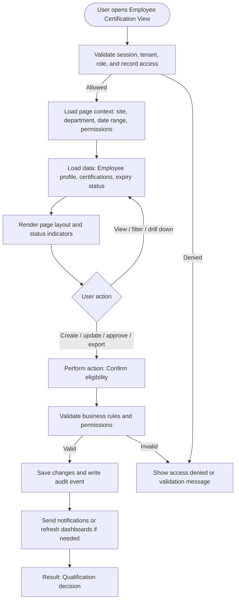

# Employee Certification View

| Field | Detail |
|---|---|
| Page Type | Mobile Screen |
| Module | Mobile People |
| Primary Roles | Supervisor |
| Purpose | Validate employee qualification. |

## What This Page Shows

| Area | Content |
|---|---|
| Header | Page title, site/tenant context, date range where applicable, role-aware actions |
| Filters | Status, site, department, owner, date range, severity, category, or module-specific filters |
| Main Content | Employee profile, certifications, expiry status |
| Primary Action | Confirm eligibility |
| Output | Qualification decision |
| Audit Behavior | View, create, update, approve, reject, export, and confidential access actions are audit logged where applicable |

## Page Flowchart

